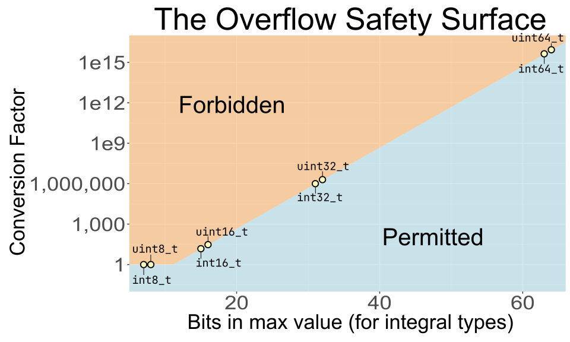

# Overflow

To convert a quantity in a program to different units, we need to multiply or divide by a conversion
factor.  Sometimes, the result is too big to fit in the type: a problem known as _overflow_.

Units libraries generate these conversion factors automatically when the program is built, and apply
them invisibly.  This amazing convenience comes with a risk: since users don't see the conversion
factors, it's easy to overlook the multiplication that's taking place under the hood.  This is even
more true in certain "hidden" conversions, where most users don't even realize that a conversion is
taking place!

## Hidden overflow risks

Consider this comparison:

```cpp
constexpr bool result = (meters(11) > yards(12));
```

Even though the quantities have different units, this code compiles and produces a correct result.
It turns out that `meters(11)` is roughly 0.2% larger than `yards(12)`, so `result` is `true`.  But
how exactly do we compute that result from these starting numeric values of `11` and `12`?

The key is to understand that _comparison_ is a [_common unit
operation_](./arithmetic.md#common-unit).  Before we can carry it out, we must convert both inputs
to their [_common unit_](./common_unit.md) --- that is, the largest unit that evenly divides both
`meters` and `yards`.  In this case, the size of that unit is 800 micrometers, giving a conversion
factor of 1250 for `meters`, and 1143 for `yards`.  The library multiplies the underlying values 11
and 12 by these respective factors, and then simply compares the results.

Now that we have a fuller understanding of what's going on under the hood, let's take another look
at the code.  When we see something like `meters(11) > yards(12)`, it's certainly not obvious at
a glance that this will multiply each underlying value by a factor of over 1,000!  Whatever approach
we take to mitigating overflow risk, it will need to handle these kinds of "hidden" cases as well.

## Mitigation Strategies

Over the decades that people have been writing units libraries, several approaches have emerged for
dealing with this category of risk.  That said, there isn't a consensus about the best approach to
take --- in fact, at the time of writing, new strategies are still being developed and tested!

### Do nothing

This is the simplest approach, and probably also the most popular: make the users responsible for
avoiding overflow.  The documentation may simply warn them to check their values ahead of time, as
in this [example from the bernedom/SI
library](https://github.com/bernedom/SI/blob/main/doc/implementation-details.md#implicit-ratio-conversion--possible-loss-of-precision).

While this approach is perfectly valid, it does put a lot of responsibility onto the end users, many
of whom may not realize that they have incurred it.  Even for those who do, we've seen above that
many unit conversions are hard to spot.  It's reasonable to assume that this approach leads to the
highest incidence of overflow bugs.

### Curate user-facing types

The [`std::chrono`](https://en.cppreference.com/w/cpp/chrono/duration) library, a time-only units
library, takes a different approach.  It uses intimate knowledge of the domain to craft its
user-facing types such that they all cover the same (very generous) range of values. Specifically,
every `std::chrono::duration` type shorter than a day --- everything from `std::chrono::hours`, all
the way down to `std::chrono::nanoseconds` --- is guaranteed to be able to represent _at least_ ±292
years.

As long as users' durations are within this range --- _and_, as long as they _stick to these primary
user-facing types_ --- they can be confident that their values won't overflow.

This approach works very well in practice for the (great many) users who can meet both of these
conditions.  However, it doesn't translate well to a _multi-dimensional_ units library: since there
are many dimensions, and new ones can be created on the fly, it's infeasible to try to define
a "practical range" for _all_ of them.  Besides, users can still form arbitrary
`std::chrono::duration` types, and they may not realize the safety they have given up in doing so.

### Adapt to risk

Fundamentally, there are two contributions to the level of overflow risk:

1. The _size of the conversion factor_: **bigger factors** mean **more risk**.

2. The _largest representable value in the destination type_: **larger max values** mean **less
   risk**.

Therefore, we should be able to create an _adaptive policy_ that takes these factors into account.
The key concept is the "smallest overflowing value".  For every combination of "conversion factor"
and "type," there is some smallest starting-value that will overflow.  The simplest adaptive policy
is to forbid conversions when that smallest value is "small enough to be scary".

How small is "scary"?  Here are some considerations.

- Once our values get over 1,000, we can consider switching to a larger SI-prefixed version of the
  unit.  (For example, lengths over $1000\,\text{m}$ can be approximated in $\text{km}$.)  This
  means that if a value as small as 1,000 would overflow --- so small that we haven't even _reached_
  the next unit --- we should _definitely_ forbid the conversion.

- On the other hand, we've found it useful to initialize, say, `QuantityI32<Hertz>` variables with
  something like `mega(hertz)(500)`.  Thus, we'd like this operation to succeed (although it should
  probably be near the border of what's allowed).

Putting it all together, we settled on [a value threshold of 2'147][threshold].  If we can convert
this value without overflow, then we permit the operation; otherwise, we don't.  We picked this
value because it satisfies our above criteria nicely.  It will prevent operations that can't handle
values of 1,000, but it still lets us use $\text{MHz}$ freely when storing $\text{Hz}$ quantities in
`int32_t`.

#### Plot: the Overflow Safety Surface

This policy lends itself well to visualization.  For each integral type, there is some _biggest
allowable conversion factor_ under this policy.  We can plot these factors for each of the common
integral types (`int8_t`, `uint32_t`, and so on).  If we then "connect the dots", we get a boundary
that separates allowed conversions from forbidden ones, permitting bigger conversions for bigger
types. We call this abstract boundary the **"overflow safety surface"**, and it's the secret
ingredient that lets Au users use a wide variety of integral types with confidence.



### Check every conversion at runtime

While the overflow safety surface is a leap forward in safety and flexibility, it's still only
a heuristic.  There will always be valid conversions which it forbids, and invalid ones which it
permits.  On the latter point, note that adding an intermediate conversion can defeat the safety
check: the overflow in `meters(10u).as(nano(meters))` would be caught, but the overflow in
`meters(10u).as(milli(meters)).as(nano(meters))` would not.

One way to guarantee doing better is to check every conversion at runtime.  Some users may recoil at
the idea of doing _runtime_ work in a units library, but it's easy to show that _this_ use case is
innocuous. Consider: it's very hard to imagine a valid use case for performing unit conversions in
a "hot loop".  Therefore, the extra runtime cost --- merely a few cycles at most --- won't
_meaningfully_ affect the performance of the program: it's a bargain price to pay for the added
safety.

At the time of writing, we don't know of any units library that checks every conversion at runtime.
However, we are planning to make it easy for Au users to build their own.  Au can handle the "hard
part" by generating a `bool` function for every possible unit conversion --- that is, every
combination of conversion factor and underlying numeric rep.  We can make this function just as
efficient as any custom implementation which a user might write by hand.  With these functions
available, it will be easy for users to make their own checked-conversion API, using their favorite
error handling mechanism (whether exceptions, `std::optional`, or anything else).  This work is
tracked in [issue #110][#110], and we expect to complete it before our next minor version release of
Au.

## Summary

The hazard of overflow lurks behind every unit conversion --- even the "hidden" conversions that are
hard to spot. To maximize safety, we need a strategy to mitigate this risk.  Au's novel overflow
safety surface is a big step forward, adapting to the level of risk actually present in each
specific conversion.  But the most robust solution of all is to make it as easy as possible to check
every conversion as it happens, and be prepared for it to fail.

[threshold]: https://github.com/aurora-opensource/au/blob/dbd79b2/au/conversion_policy.hh#L27-L28
[#110]: https://github.com/aurora-opensource/au/issues/110
