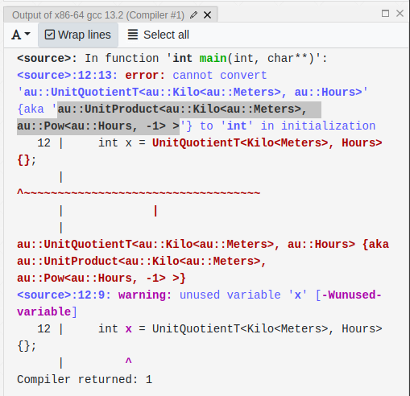

# Forward declarations

Forward declarations can meaningfully speed up the compilation of C++ programs in some situations,
but creating them manually can also be error prone.  Au includes authoritatively correct and tested
forward declarations.  This page explains how to use them.

!!! tip
    Au itself is generally pretty fast to compile, costing under a second on most modern
    configurations.  Most users won't need to forward declare Au's types.  However, for situations
    where you really do need every bit of speed, these forward declarations can help.

!!! note
    We are omitting the `au::` namespace in the text of this how-to guide, for conciseness and
    readability.  However, all code samples will include the `au::` namespace qualification wherever
    appropriate.

## How to use {#how-to-use}

First, identify the file in your project that could benefit from forward declarations.  _This is
usually a file that gets included in several other files,_ and the point is to speed up compilation
for those other files.  The header file (`*.hh`) for a library target can sometimes benefit from
forward declarations.  A few library targets in your project might even provide _their own_ forward
declaration files (`*_fwd.hh`) --- in these instances, you'll definitely want to use Au's forward
declarations.

!!! note
    If you're defining compound units (as explained below), you'll _also_ need to identify
    a _corresponding_ file that will include the full Au headers.  If there's an associated `.cc`
    file, this is always a good choice.  Alternatively, if this is a library target that provides
    a `_fwd.hh` file, then you can use the corresponding `.hh` file.

Once you've identified which file(s) will be using the forward declarations, you'll include the
appropriate `"fwd"` headers from Au in that file, while using the "full" Au headers in the other
files for that target.

Here are Au's forward declaration headers, and what each provides.

### Core library types: `"au/fwd.hh"`

**Every use of Au forward declarations must include this file.**  It provides both core library
types, and a few utilities for combining other units.

Here's a partial listing of what's included in the core library forward declarations.

- `Quantity<U, R>` type (note that you'll need forward-declared _units_ for this to be useful)
- `QuantityD<U>`, `QuantityI<U>`, and the other "rep-named aliases" for `Quantity`
- `QuantityPoint<U, R>` type (again: requires _units_ to be forward declared separately)
- `QuantityPointD<U>`, `QuantityPointI<U>`, and the other "rep-named aliases" for `QuantityPoint`
- `Kilo`, `Mega`, and the other SI prefixes
- `Zero` type (but not the `ZERO` instance)
- `ForwardDeclareUnitPow` and `ForwardDeclareUnitProduct` to help forward declare _compound units_
  (we'll explain how to use these further below).

### Unit types: `"au/units/xyz_fwd.hh"`

Any unit that can be found in, say, `"au/units/xyz.hh"` will have a corresponding forward
declaration file, `"au/units/xyz_fwd.hh"`.

When combined with the core library forward declarations, this is enough to declare an interface
that takes, say, `const QuantityD<Kilo<Meters>>&` as an argument.

This is _not_ enough to forward declare a _compound unit_, such as meters per second.  Our [best
practices](./new-units.md#alias-vs-strong) for new units suggests using a simple _alias_ in this
case, rather than a strong type (for example, `UnitQuotientT<Meters, Seconds>`).  However, this
cannot be computed without the full machinery of the library, which can cost tens of milliseconds.
This may not sound like much, but it's far too slow for a forward declaration file.

??? note "How slow is \"too slow\"?"
    Time measurements will of course vary based on the hardware and toolchain, but here are some
    numbers from one modern development machine.

    We found that the cost to include `"au/fwd.hh"` was about 5 ms.  The vast majority of this was
    the cost of including `<cstdint>`.  If your file already includes `<cstdint>` by some other
    pathway --- which is extremely common --- then there is no additional cost to include it
    a second time via `"au/fwd.hh"`.  In this case, the remaining cost was about 1 ms.  This is the
    target that we aim for.

    For calibration purposes, the cost of including `<vector>` on this same configuration was about
    100 ms.  And the cost of including `"au/au.hh"` --- essentially, "the whole library" (without
    individual units) --- was around 500 ms.

We resolve this with a "warrant and check" approach, explained in the next section.

### Compound units

The only way to forward declare a compound unit is to specify the exact types that go into the
`UnitProductPack<...>` template, and in the exact correct order.  We generally avoid having end
users do this, both because it's hard to get right, and because it's an encapsulated implementation
detail which could change.  However, for cases where the added speed from forward declaration really
matters, we can do the next best thing: make it easy to check that it's right.

Here is a series of steps to follow to forward declare compound units.

1.  **Find the types in `UnitProductPack<...>`.**  One trick to do this is to assign an instance of
    the compound unit type itself to another type, say, an `int`.  The _compiler error_ will contain
    the correct type name.  Look for `UnitProductPack<...>` in the error message.

2.  **Forward declare the powers with `ForwardDeclareUnitPow<...>`.**  If any of the types in
    `UnitProductPack<...>` are instances of `Pow` or `RatioPow`, you'll want to make an alias for
    those types.  If your compound unit is, say, the inverse cube of a unit, you can forward declare
    it like this:

    ```cpp
    using InverseYourUnitsCubedFwd = au::ForwardDeclareUnitPow<YourUnits, -3>;
    using InverseYourUnitsCubed = YourUnitsCubedFwd::unit_type;
    ```

    If you add a third template parameter to `ForwardDeclareUnitPow`, it will be treated as the
    denominator for the power.  For example, to form a square root of the above unit, you could use
    `ForwardDeclareUnitPow<YourUnits, 1, 2>`.

3.  **Forward declare the product itself with `ForwardDeclareUnitProduct<...>`.**  This is similar
    to the above.  For example, if the full product type from step 1 was
    `UnitProductPack<OtherUnits, Pow<YourUnits, -3>>`, you would forward declare it like this (using
    the existing `InverseYourUnitsCubed` that you would have defined in step 2):

    ```cpp
    using OtherUnitsPerYourUnitsCubedFwd = au::ForwardDeclareUnitProduct<OtherUnits, InverseYourUnitsCubed>;
    using OtherUnitsPerYourUnitsCubed = OtherUnitsPerYourUnitsCubedFwd::unit_type;
    ```

4.  **Add appropriate checks.**  These will go in the "corresponding file" (see the Note in the
    [above section](#how-to-use)).  You can pass an instance of the `ForwardDeclare...<...>` type to
    the utility `is_forward_declared_unit_valid(...)`, which can be used with `static_assert`.  For
    example:

    ```cpp
    // In whatever file _corresponds to_ the one with the forward declarations:
    static_assert(au::is_forward_declared_unit_valid(InverseYourUnitsCubedFwd{}));
    static_assert(au::is_forward_declared_unit_valid(OtherUnitsPerYourUnitsCubedFwd{}));
    ```

## Full worked example

Suppose we want to make a library target that can print a speed, in km/h, to a `std::string`.
Suppose, too, that we want our library to be as lightweight as possible: maybe some client targets
are interacting with all of their `Quantity` types by const-ref, so they don't actually need to see
Au's definitions.

Normally, we'd refer to our speed type as `QuantityD<UnitQuotientT<Kilo<Meters>, Hours>>`.  However,
`UnitQuotientT` needs the full machinery of the library.  Instead, let's create an alias,
`KilometersPerHour`, so we can write `QuantityD<KilometersPerHour>`.

The first step is to find out which types go inside `UnitProductPack<...>`, and in which order.
This [compiler explorer link](https://godbolt.org/z/cW3Gs7YzT) shows how to do this.  Note the
highlighted portion of the error message:



!!! note
    The screenshot is from an earlier version of software, where the unit product pack type name was
    `UnitProduct<...>` rather than `UnitProductPack<...>`.  We will update both the link and the
    screenshot in a follow-on PR.

We can see that the types are `Kilo<Meters>` and `Pow<Hours, -1>`, in that order.  We'll need to
start by defining an alias for the latter alone.  Then, we can define our `KilometersPerHour` alias,
and declare our function signature.  Here's what it looks like all together.

First, the header file:

```cpp
// print_speed.hh

#pragma once

#include <string>

#include "au/fwd.hh"
#include "au/units/hours_fwd.hh"
#include "au/units/meters_fwd.hh"

namespace my_library {

using InverseHoursFwd = au::ForwardDeclareUnitPow<au::Hours, -1>;
using InverseHours = typename InverseHoursFwd::unit_type;

using KilometersPerHourFwd = au::ForwardDeclareUnitProduct<au::Kilo<au::Meters>, InverseHours>;
using KilometersPerHour = typename KilometersPerHourFwd::unit_type;

std::string print_to_string(const au::QuantityD<KilometersPerHour>& speed);

}  // namespace my_library
```

Now, the implementation file:

```cpp
// print_speed.cc

#include "print_speed.hh"

#include <sstream>
#include <string>

#include "au/io.hh"
#include "au/quantity.hh"
#include "au/units/hours.hh"
#include "au/units/meters.hh"

namespace my_library {

static_assert(au::is_forward_declared_unit_valid(InverseHoursFwd{}));
static_assert(au::is_forward_declared_unit_valid(KilometersPerHourFwd{}));

std::string print_to_string(const au::QuantityD<KilometersPerHour>& speed) {
    std::ostringstream oss;
    oss << speed;
    return oss.str();
}

}  // namespace my_library
```

At this point, the cost of including `print_speed.hh` in other files should be almost completely
negligible, beyond the cost of including `<string>`.
