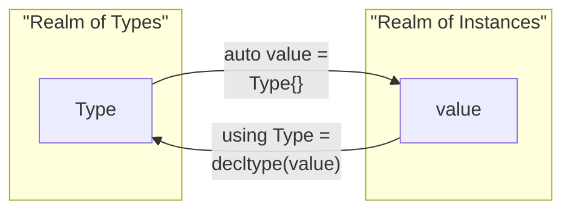

# Monovalue Types

A "monovalue type" is a type which can only hold a single value.  This means that knowing the type
is _equivalent_ to knowing the value, and vice versa.  We can convert back and forth between
representing it as a type, and as a value, depending on our needs.

We named this concept because it occurs again and again in Au, and the name makes it easier to refer
to.  The "monovalue" name is based on
[`std::monostate`](https://en.cppreference.com/w/cpp/utility/variant/monostate), which has these
properties.  However, "monostate" could have been confused with the [monostate
_pattern_](https://www.simplethread.com/the-monostate-pattern/), which exposes actual, changeable,
global state to its users.  "Monovalue" also emphasizes _value semantics_, which is a core property
of these types.

## Identifying monovalue types

A type `T` is a monovalue type when it fulfills these conditions.

1. `T` can be instantiated.
2. Every instance of `T` behaves identically to every other instance, in every way, and this
   behavior does not depend on any program state.
3. Instances of `T` support some set of operations with other types.

These properties mean we can freely convert a monovalue object between its "type" and "value"
representations.  This is a core feature of monovalue types.

The second property also distinguishes monovalue types from the monostate pattern mentioned above.

The third property means there has to be something you can _do_ with the instances.

## Examples of monovalue types

Here are some canonical examples in Au.

| Type | Instance | Example Operations |
|------|----------|------------|
| `Zero` | `ZERO` | Comparing to any `Quantity` |
| `Magnitude<>` | `ONE` | <ul><li>Equality comparison with other Magnitudes</li><li>`get_value<T>(ONE)`</li></ul> |
| `Radians` (and other units) | `Radians{}` (no special pre-formed instance) | Arithmetic with other units, such as `Radians{} / Meters{}` |
| `Constant<...>` | `SPEED_OF_LIGHT` | <ul><li>Comparing to any same-dimension `Quantity`</li><li>`Quantity` construction with exact conversion policy</li><li>zero-cost multiplying to change units/dimensions of numbers and `Quantity` instances</li></ul> |

## Switching between types and values {#switching}

To get the value of a monovalue type `T`, instantiate the type using `T{}`.

To get the type of a monovalue type value `t`, pass it to `decltype(t)`.  However, if `t` is `const`
(including `constexpr`), you'll need to use `std::decay_t<decltype(t)>`.

??? info "More details on when to use `std::decay_t`"
    It's common to provide `constexpr` instances of monovalue types, like the following.

    ```cpp
    static constexpr auto ZERO = Zero{};
    ```

    In this case, `decltype(ZERO)` would be `const Zero`, not simply `Zero`.  If we tried comparing
    this to `Zero` in a type trait, it could fail.

    Using `std::decay_t` is a concise way to avoid this problem.  However, it only arises for
    `const` or `constexpr` instances --- and only when comparing types for exact equality --- so
    most users won't need to worry about this most of the time.

This diagram summarizes how to go back and forth using `{}` and `decltype()`.



