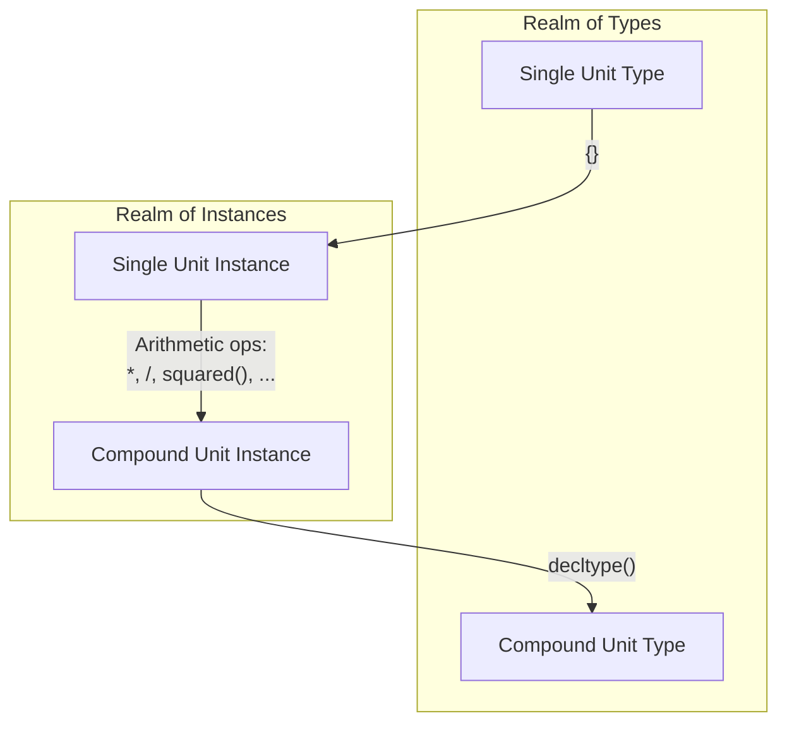

# Au 102: API Types

This tutorial explains how to name your types in function parameters and member variables.

- **Time:** 30 minutes.
- **Prerequisites:** [Au 101: Quantity Makers](./101-quantity-makers.md).
- **You will learn:**
    - The `Quantity<Unit, Rep>` type template.
    - The convenient aliases (`QuantityD<Unit>`, `QuantityI32<Unit>`, etc.) for each storage type.
    - How to form compound units.
    - A strategy for upgrading the APIs of existing functions.

## The `Quantity<Unit, Rep>` template

In the [previous tutorial](./101-quantity-makers.md), we practiced getting values into and out of
the library, and even performing a few simple operations.  However, we skipped the type name.  Let's
learn it now---we'll need it in order to use a quantity as a function parameter, or a member
variable.

We store our quantities in a type template with two template parameters: `Quantity<Unit, Rep>`.
`Unit` is a type representing the unit of measure.  `Rep`, short for "Representation", is the
underlying numeric storage type. Here's how to provide each parameter.

- **`Unit`**:
    - This will typically be the `CamelCase` version of the quantity maker, which is itself
      represented in `snake_case`.  (For example, for the quantity maker `meters`, the unit type is
      `Meters`.)

    - You can also provide a _compound_ unit.  We'll explain how to form compound units later in
      this section.

- **`Rep`**:
    - This can be any numeric type: either floating point (`double`, `float`), or integral (`int`,
      `uint64_t`, ...).

!!! note
    Someday, we also hope to support more than just built-in numeric types for the Rep!  See [#52]
    for details.

## `QuantityD<Unit>`, and other aliases

Templates with multiple parameters (for example, `Quantity<Meters, double>`) can be cumbersome.  The
whitespace in the type name can make it harder to read at a glance.  Moreover, preprocessor macros
will be unable to parse it unless you surround it with extra parentheses.[^1]

[^1]: While we avoid using macros in our own library, we can't avoid them in others!  Even within
this repository, we use googletest for our test cases, and googletest is macro-based.

To make things easier, we provide concise aliases to handle the most common cases.  For example,
`QuantityD<Meters>` (think: `D` for `double`) is identical to `Quantity<Meters, double>`.  Here's
a table of the ones we support out of the box:

| Rep | Alias |
|-----|-------|
| `double` | `QuantityD` |
| `float` | `QuantityF` |
| `int32_t` | `QuantityI32` |
| `uint32_t` | `QuantityU32` |
| `int64_t` | `QuantityI64` |
| `uint64_t` | `QuantityU64` |

## Building new units from old

What if your unit doesn't have its own proper name, but is instead built from other units?  For
example, "centimeters" is built from the named unit "meters" by _applying a prefix_, which scales
it.  Also, "revolutions per minute" is simply the _quotient_ of the named units "revolutions" and
"minutes".  Here's how we handle these cases.

### Prefixed units

Every SI and binary prefix is available as a `CamelCase`-named template.  If you apply it to a unit,
you'll create the prefixed unit.

- Example: `Centi<Meters>` is a unit of $\text{cm}$.
- Example: `Gibi<Bytes>` is a unit of $\text{GiB}$.

### Compound units

"Compound units" are units such as "meters per second squared", where we form new units by
essentially _doing arithmetic_ on existing ones.  This gets a little more complicated than prefixes,
because even though we're both starting and ending with _types_, the arithmetic itself is more
natural to perform on _instances_.  So here are the steps.

1. Convert each unit _type_ to an _instance_, by instantiating it with `{}`.

    - For example: `Meters` is a _type_; `Meters{}` is an _instance_.

2. Perform your arithmetic operation(s), making _compound unit instances_ out
   of your _single unit instances_.

    - For example: `Meters{} / squared(Seconds{})`.

3. Pass the result to `decltype()`, to go from your instance back to the _type_.

Or, in diagram form, here's how we enter the "realm of instances" to do our arithmetic, and then
return to the "realm of types":



Generally the best move is to store the result in an alias.  Here's a complete example.

```cpp
using MetersPerSecondSquared = decltype(Meters{} / squared(Seconds{}));
```

Now you can easily form, e.g., a `QuantityD<MetersPerSecondSquared>` to hold your acceleration
values.

## Exercise: upgrading an API

To get some practice with these API types, we've included an exercise where you can offer
a unit-safe interface alongside a legacy one.

Check out the [Au 102: API Types Exercise](./exercise/102-api-types.md)!

## Takeaways

1. The **type name** for a quantity is **`Quantity<Unit, Rep>`**, where `Unit` is the (`CamelCase`)
   name of the unit, and `Rep` is the storage type.

    - For example, the return type of `meters(3)` is `Quantity<Meters, int>`.

2. Prefer using the **alias for each storage type**, because using multiple template parameters can
   be cumbersome.

    - For example, `QuantityU64<Seconds>` is an alias for `Quantity<Seconds, uint64_t>`.

3. You can **apply any prefix** to a unit type.

    - For example, `Mega<Hertz>` is the unit type for the quantity maker `mega(hertz)`.

4. You can **form compound units** by simply performing arithmetic on **instances** of the unit
   types, and defining an alias.

    - For example, `decltype(Meters{} / squared(Seconds{}))` is a unit _type_, representing the unit
    $\text{m} / \text{s}^2$.

[#52]: https://github.com/aurora-opensource/au/issues/52
